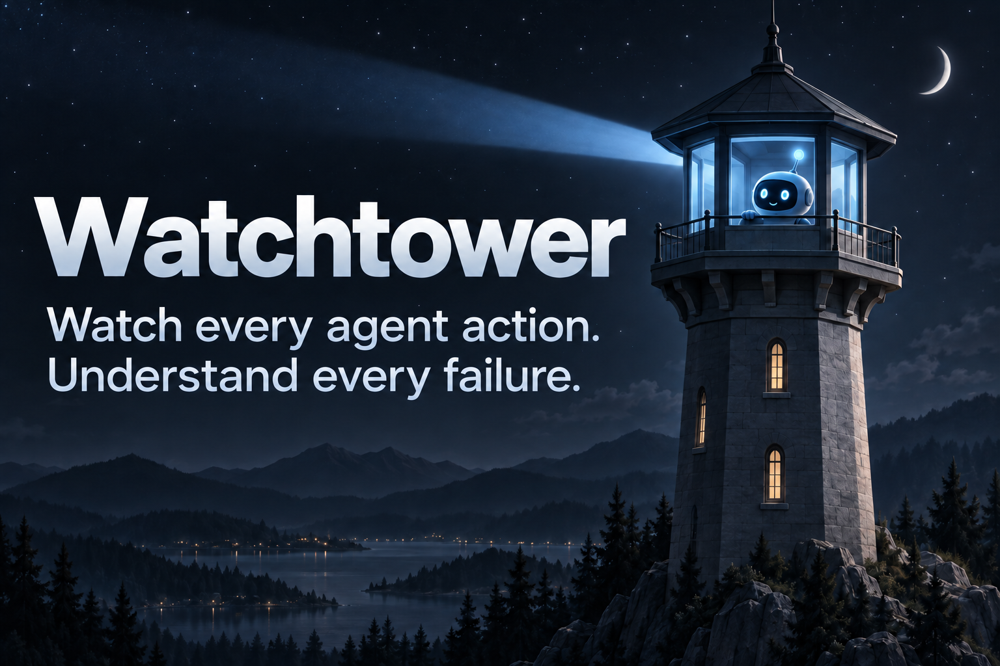

<div align="center">



Your agents. Every action. All in view.

[](https://github.com/sihaowu1/htn)
[](https://github.com/sihaowu1/htn/network/members)

</div>

---

**Know what your AI agents actually did.**

Watchtower turns a website-testing request into coordinated browser-agent runs. Watch agents follow distinct paths in isolated browsers, inspect their actions, and read failure reports backed by logged evidence. Successful and failed runs leave a record for debugging and future model training.

## Key Features

### Task-Scoped Exploration

Describe what to test and Watchtower explores only what matters.

- **Goal-Focused Discovery**: A request to test search stops at search results, even if the site also offers checkout.
- **Flow Maps**: Discovered states, transitions, and paths are saved as a reusable JSON map you can download, correct, and replay.
- **Explicit Coverage Limits**: Unexplored branches, unsupported interactions, and replay failures are recorded rather than hidden.

### Parallel Browser Agents

Three workers run distinct paths at once.

- **Isolated Sessions**: Each worker starts from the same entry point in its own cloud browser with no shared storage.
- **Path Diversity**: The best goal-reaching route is kept, then the rest maximize early behavioral divergence, including exploratory branches.
- **Step-by-Step Execution**: Workers receive one validated instruction at a time and verify each resulting state before moving on.
- **Live Viewing**: Watch every worker browser from the Control Room.

### Observation & Evidence

Know what your agents actually did.

- **Global Event Log**: Actions, tool calls, browser events, errors, and outcomes are written to `logs/events.jsonl`, correlated by run, agent, and session IDs.
- **Evidence-Backed Reports**: The observer cites real log events and separates observed failures from suspected causes.
- **Training Data**: Successful and failed runs leave a record for debugging your site and improving future models.

## Tech Stack

| Layer | Technologies |
|-------|-------------|
| Runtime | Node.js 22+, TypeScript |
| Backend | Express, PostgreSQL, optional Elastic Cloud, server-sent event stream |
| Frontend | Plain HTML, CSS, JavaScript, hls.js |
| Discovery browser | Local Playwright Chromium |
| Worker browsers | Browserbase cloud sessions, driven via Playwright and CDP |
| AI models | OpenAI (Responses API for discovery, Chat Completions for workers and observer) |
| Telemetry | Sentry, PostgreSQL persistent evidence log, local JSONL events |
| Tunnel | ngrok, to expose the local target to cloud workers |

## How It Works

### Run workflow

```
Task + target URL
  -> Discovery crawls the local site, keeping only goal-relevant interactions
  -> Flow map of states, transitions, and paths (cached or imported)
  -> Deterministic orchestrator selects three paths
  -> Three workers execute in isolated Browserbase sessions
  -> Global observer analyzes the event log
  -> Results, events, and evidence-backed report
```

### Discovery

```
Local site served on an ephemeral port
  -> Local Chromium renders and navigates depth-first
  -> Model keeps goal-relevant branches and flags the goal state
  -> URLs rewritten onto the public tunnel address
  -> Flow map saved to logs/tree_demo.json
```

### Execution and observation

```
Selected path
  -> Worker receives one destination instruction
  -> Validated action runs in the live browser
  -> Resulting state verified against the map
  -> Every step logged with run, agent, and session IDs
  -> Observer cites those events in its report
```

## Quick Start

You'll need **Node.js 22+**, OpenAI and Browserbase credentials, a Sentry DSN, and a tunnel such as ngrok.

### 1. Install dependencies

From the repository root:

```sh
npm ci
npx playwright install chromium
```

### 2. Configure the environment

Copy `.env.example` to `.env`:

```sh
# macOS / Linux
cp .env.example .env
```

```powershell
# Windows PowerShell
Copy-Item .env.example .env
```

Fill in the credentials below. Keep `.env` local. Change model settings if needed for your account, using models that support the required API and structured outputs.

| Variable | Purpose | Required |
| --- | --- | --- |
| `OPENAI_API_KEY` | Model access for discovery, planning, workers, and observation | Yes |
| `BROWSERBASE_API_KEY` | Create isolated cloud browser sessions | Yes |
| `BROWSERBASE_PROJECT_ID` | Browserbase project for those sessions | Yes |
| `DATABASE_URL` | PostgreSQL connection string for evidence and investigation persistence | Yes |
| `SENTRY_DSN` | Error and performance reporting | Yes, for the current run API |
| `ELASTICSEARCH_ENABLED` | Enable Elastic Cloud search integration (`true`/`false`) | Optional; defaults to `false` |
| `ELASTICSEARCH_URL` | Elastic Cloud search endpoint | Optional |
| `ELASTICSEARCH_API_KEY` | Elastic Cloud API key | Optional |
| `OPENAI_MODEL` | Worker and observer model | Set in `.env.example` |
| `OPENAI_CRAWLER_MODEL` | Discovery model | Set in `.env.example` |
| `OPENAI_ORCHESTRATOR_MODEL` | Path-selection model | Set in `.env.example` |
| `PORT` | Watchtower server port | No; defaults to `3000` |

Although `.env.example` labels Sentry optional, the current server requires `SENTRY_DSN` to start a run. Events are also saved locally in `logs/events.jsonl` and persisted to PostgreSQL.

### 3. Serve the target website

```sh
npx --yes http-server local_website -a 127.0.0.1 -p 8080
```

To test your own site, replace the contents of `local_website/` with your disposable static website. Discovery reads this directory using local Chromium; workers must reach the same site through its public URL. Use repeatable test data: fresh browser sessions reset browser storage, but do not reset backend data.

### 4. Expose the target

With ngrok installed, configure your account token and start the tunnel in another terminal:

```sh
ngrok config add-authtoken YOUR_TOKEN
ngrok http 127.0.0.1:8080
```

Copy the HTTPS forwarding URL. Browserbase runs in the cloud and needs this public address to reach your target. Watchtower automatically sends the header that skips ngrok's browser warning for worker requests.

### 5. Start Watchtower

Start the API and the background investigation observer worker in separate terminals:

```sh
# Terminal 1: Watchtower API
npm run dev

# Terminal 2: Observer & investigation worker
npm run dev:observer
```

Optional Elastic Cloud search can be enabled with `ELASTICSEARCH_ENABLED=true`. After enabling it for an existing database, run `npm run search:backfill` once to build and atomically activate the search indices.

Open **[http://localhost:3000](http://localhost:3000)** and click **Get started**. Keep the target server and tunnel running.

## Your First Run

1. Paste the HTTPS tunnel URL into **Target website** under **Task Assignment**.
2. Enter a specific task, such as: **“Test search with matching and no-result queries. Stop at the results.”**
3. Choose **Maximum simultaneous workers** and click **Start run**.
4. Watch discovery and the worker browsers, then inspect **Results**, **Events**, and **Observer** for outcomes and supporting evidence. Click **Stop** to cancel.

Discovery explores locally before cloud workers launch. A discovered path is a candidate for execution; check worker results and observer evidence to see what actually happened. Watchtower supports one active run at a time.

For a smaller smoke test, open **Run options** and enable **Test single action**. This skips discovery and planning, runs one worker on a simple task using controls observed on the initial page, and stops.

## Replay with a Flow Map

If discovery misses a route, use **Download flow map**, correct the JSON, and upload it under **Run options → Flow map** on the next run.

- [Example flow map](examples/flow-map.json): the supported version 1 format.
- [Mock store flow map](examples/local-website-flow-map.json): expected routes for the included store. Replace every placeholder host with your tunnel address before uploading.

The map's `startUrl` must match the target URL exactly, including its path and trailing slash. To allow more discovery, adjust `CRAWL_MAX_STATES`, `CRAWL_MAX_DEPTH`, or `CRAWL_TIMEOUT_MS` in `.env` and restart Watchtower. `MAX_PATHS` limits selected paths; `MAX_WORKERS` caps simultaneous workers.

## Find Your Run Logs

| Location | What you'll find |
| --- | --- |
| `logs/events.jsonl` | Global event history, including actions, errors, and outcomes |
| `logs/orchestrator/<run-id>/` | Selected path bundles saved before workers launch |
| Control Room | Live browsers, discovery coverage, worker results, and observer reports |

Use run, agent, and Browserbase session IDs to correlate events with browser sessions and Sentry reports.

## Run the Compiled App

```sh
npm run build
npm start
npm run start:observer
```

For architecture, contributor guidance, and test commands, see [AGENTS.md](AGENTS.md).
