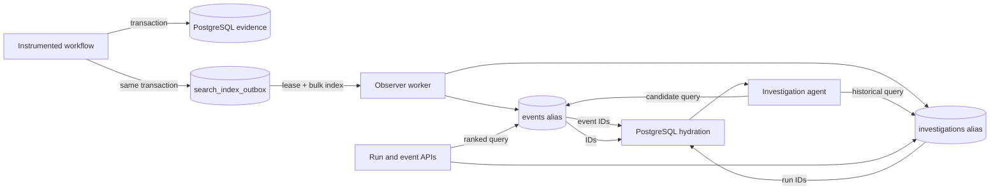

# Elasticsearch search layer

This document explains how HTN uses Elastic Cloud for evidence discovery,
historical incident lookup, and operator search. Elasticsearch is optional and
eventually consistent. PostgreSQL remains the authoritative store for events,
investigations, access scope, ordering, and report citations.

## Responsibilities and trust boundary

Elasticsearch performs ranked lexical retrieval. It does not:

- create or deduplicate incidents;
- schedule investigation jobs;
- establish causal relationships;
- authorize access to evidence;
- validate report citations; or
- store artifact contents.

Every current-run event returned to an investigator or API caller is hydrated
from PostgreSQL. Missing, stale, or cross-run search hits are discarded. The
investigation report validator continues to verify all cited event, execution,
and artifact IDs against PostgreSQL before saving a report.



## Configuration

Set the following values in `.env`:

```dotenv
ELASTICSEARCH_ENABLED=true
ELASTICSEARCH_URL=https://your-deployment.es.region.provider.cloud
ELASTICSEARCH_API_KEY=your-api-key
ELASTICSEARCH_INDEX_PREFIX=htn
ELASTICSEARCH_TIMEOUT_MS=10000
```

| Variable | Meaning |
| --- | --- |
| `ELASTICSEARCH_ENABLED` | Enables index initialization, background indexing, and Elasticsearch-backed queries. Defaults to `false`. |
| `ELASTICSEARCH_URL` | Elastic Cloud Elasticsearch endpoint. |
| `ELASTICSEARCH_API_KEY` | Server-side API key used by the official Node client. It is never returned to the frontend. |
| `ELASTICSEARCH_INDEX_PREFIX` | Prefix for aliases and physical indices. Defaults to `htn`. |
| `ELASTICSEARCH_TIMEOUT_MS` | Per-request client timeout. Defaults to 10 seconds. |

When Elasticsearch is disabled, the application continues to store and
investigate evidence normally. Dashboard text searches use PostgreSQL. The two
investigator search tools return an explicit availability gap rather than
failing the investigation.

## Indices and document shape

The service creates two aliases:

| Alias | Stable document ID | Contents |
| --- | --- | --- |
| `<prefix>-events` | `event_id` | Event correlation fields, agent identity, assigned task, run goal, selected structured metadata, and flattened searchable text. |
| `<prefix>-investigations` | `investigation_id:revision` | Validated report summary, outcome, trigger type, likely cause, confidence, and suggested/reproduction steps. |

On first initialization, the aliases point to `<prefix>-events-v1` and
`<prefix>-investigations-v1`. Backfills create timestamped physical indices and
atomically move the aliases after successful indexing.

Mappings use `keyword` fields for identifiers and exact filters, `date` fields
for timestamps, and `text` fields for ranked retrieval. Dynamic mapping is
disabled so unexpected metadata cannot silently expand the index schema.

### Metadata sanitization

Before an event enters the outbox, `searchableMetadata()`:

- ignores paths whose keys resemble authorization, cookies, passwords,
  secrets, tokens, API keys, or credentials;
- excludes data URLs and long base64-like values;
- traverses at most five nested levels, 50 array entries, and 100 object fields;
- caps combined searchable metadata at 8,000 characters;
- extracts selected fields such as `error`, `message`, `reason`, `tool`,
  `operation`, `check`, `status`, and `outcome` for weighted search.

This is an additional search-specific safeguard. Producers must still redact
secrets before storing authoritative PostgreSQL evidence.

## Indexing lifecycle

Event insertion and completed investigation persistence each add an outbox row
inside the same PostgreSQL transaction. A committed evidence record therefore
cannot be lost merely because Elasticsearch is unavailable at that moment.

The observer worker checks the outbox every five seconds and during its
60-second recovery pass:

1. Claim up to 100 eligible rows with `FOR UPDATE SKIP LOCKED`.
2. Mark them `running`, record the worker identity, and grant a 60-second lease.
3. Send an idempotent Elasticsearch bulk request using stable document IDs.
4. Mark the rows `completed` after the entire batch succeeds.
5. On failure, return the rows to `queued` with exponential backoff capped at
   60 seconds.
6. Recover expired `running` leases on the maintenance pass.

A partially failed bulk response retries the complete batch. Stable document
IDs make that safe because indexing overwrites the same logical documents.

Useful operational query:

```sql
SELECT status, COUNT(*) AS documents, MIN(created_at) AS oldest
FROM search_index_outbox
GROUP BY status
ORDER BY status;
```

A growing `queued` count or old `running` rows indicates unavailable Elastic
Cloud credentials, connectivity problems, mapping errors, or a stopped observer
worker. Details are stored in `last_error` and also logged by the worker.

## Investigator search tools

### `search_run_evidence`

This tool locates candidate events within the active investigation run. It
supports free text plus event-type, agent, and before/after filters, returning at
most 25 candidates.

The evidence layer ignores any attempt to change the active run scope. Search
hits are loaded again from PostgreSQL with an exact `run_id` and `event_id`
predicate, counted against the investigation's event-read budget, and returned
without full metadata. The agent must open a candidate through `get_event`,
`get_agent_events`, or `get_related_events` before citing it.

### `find_similar_incidents`

This tool searches completed investigation reports from other runs. It supports
optional trigger-type and cause-category filters and returns at most ten
matches. Results include a summary, outcome, likely-cause category, confidence,
score, and highlights.

The active run is explicitly excluded. These results are labelled historical
context and may guide a hypothesis or next step, but historical IDs cannot be
used as evidence for current-run observed facts.

Both tools use lexical `multi_match` queries with automatic fuzziness. Error and
failure-description fields receive the strongest boosts, followed by event type,
agent, run goal, tool, operation, and general metadata.

## Dashboard and API search

Existing routes and query parameters remain unchanged:

```text
GET /api/runs?search=checkout
GET /api/runs/:runId/events?search=timeout&type=tool.failed&agent=worker-1
```

With a search term and a healthy Elasticsearch connection:

- run search queries both aliases, collapses matches by `run_id`, and hydrates
  the ranked run IDs from PostgreSQL;
- event search always includes an exact `run_id` filter and hydrates event IDs
  from PostgreSQL;
- exact filters are reapplied during PostgreSQL hydration;
- response items may contain `search_score` and `search_highlights`; and
- the response contains `searchBackend: "elasticsearch"`.

If Elasticsearch is disabled or a query fails, the same routes execute their
existing PostgreSQL `ILIKE` searches and return `searchBackend: "postgres"`.
The frontend escapes and renders highlights as plain text, so Elasticsearch
highlight content is never interpreted as HTML.

## Backfilling and rebuilding

After enabling Elasticsearch for an existing database, run:

```bash
npm run search:backfill
```

The command:

1. reads events and completed investigations from PostgreSQL in pages of 500;
2. applies the same event metadata sanitization used during live ingestion;
3. builds new timestamped physical indices;
4. refreshes them after all bulk requests succeed; and
5. atomically switches the aliases.

If a backfill fails, its incomplete physical index is deleted and the existing
aliases remain unchanged. Run the command during a quiet period or briefly stop
new workflow ingestion: documents committed to the previous write index during
the rebuild may otherwise require another backfill or a subsequent event update
after the alias switch.

## Failure behavior and current limits

- Elasticsearch is eventually consistent; newly committed evidence may not be
  immediately searchable even though it is already available in PostgreSQL.
- Search availability never controls evidence persistence or investigation-job
  completion.
- Artifact contents are not indexed.
- Search is lexical only; there are no embeddings or semantic clustering.
- Deterministic PostgreSQL failure fingerprints remain responsible for incident
  deduplication.
- Explicit event links and sequence numbers, rather than search score or time
  proximity, determine causal and execution relationships.
- Alias initialization and live Elastic Cloud behavior require real credentials;
  unit tests use mocked search services and do not establish provider health.

## Relevant implementation files

- `src/search.ts`: client, mappings, sanitization, query construction, bulk
  indexing, and alias rebuilds.
- `sql/postgres/007_search_index_outbox.sql`: durable queue schema.
- `src/sdk/pg-adapter.ts`: transactional outbox writes, leasing, retries, and
  PostgreSQL hydration.
- `src/observer-worker.ts`: background outbox draining.
- `src/evidence-tools.ts`: investigator-facing search tools and scope checks.
- `src/server.ts`: dashboard routing and PostgreSQL fallback.
- `src/search-backfill.ts`: full rebuild command.
- `tests/search.test.ts`: sanitization, run isolation, stale-hit rejection, and
  historical-context tests.
