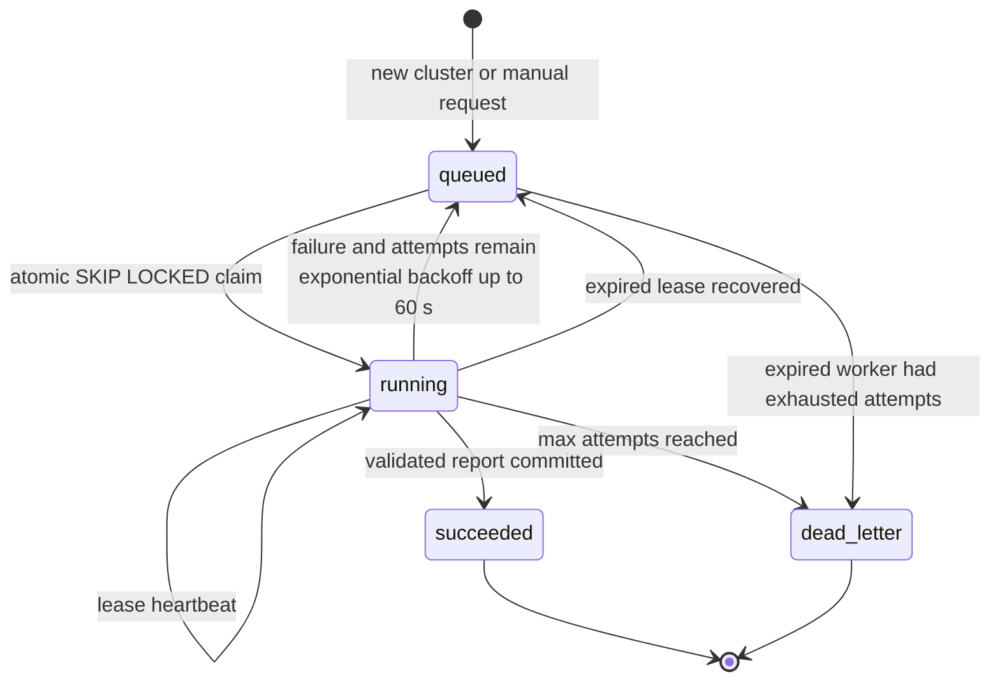

# Observability layer architecture

This document describes the observability layer as currently implemented on the
`observability` branch. It covers evidence production, durable storage, incident
detection, investigation, report validation, and delivery. The observer is
read-only with respect to the workflow it investigates: it can query evidence and
write a separate investigation report, but it cannot operate browsers or alter a
run.

## System diagram

```mermaid
flowchart LR
  User[User / operator]

  subgraph Workflow[Observed workflow process]
    Runner[Runner]
    Producers[System, crawler, orchestrator,<br/>workers, model and browser code]
    Runner --> Producers
  end

  subgraph SDK[Instrumentation and correlation]
    Context[RunContext + AgentExecutionContext<br/>run, execution, session and sequence IDs]
    Harness[Harness<br/>validate, redact, size-limit and link events]
    Memory[MemoryAdapter<br/>development fallback only]
    Context --> Harness
  end

  subgraph Evidence[Authoritative evidence plane]
    Adapter[PgAdapter]
    Detector[Failure detector + fingerprinting<br/>same transaction as new event]
    Postgres[(PostgreSQL / Supabase<br/>runs · executions · immutable events<br/>event links · artifact metadata<br/>clusters · triggers · jobs · reports)]
    Files[(Local artifact store<br/>SHA-256 content paths)]
    Adapter -->|transactional inserts| Postgres
    Adapter -->|large payload bytes| Files
    Adapter --> Detector
    Detector -->|unique run + fingerprint| Postgres
  end

  subgraph Investigation[Durable investigation worker process]
    Wake[LISTEN investigation_jobs<br/>plus 60 s recovery sweep]
    Claim[Claim queued job<br/>FOR UPDATE SKIP LOCKED]
    Observer[ObserverWorker<br/>lease, heartbeat, retry/backoff]
    Tools[Run-scoped EvidenceTools<br/>call, event and byte budgets]
    Agent[InvestigationAgent<br/>facts vs hypotheses]
    Validator[Report schema + citation validator]
    Wake --> Claim --> Observer --> Agent
    Agent <-->|bounded tool calls| Tools
    Agent --> Validator
  end

  subgraph External[External telemetry and reasoning]
    Sentry[(Sentry<br/>logs, aggregate metrics,<br/>traces and Node profiles)]
    OpenAI[OpenAI model]
    Browserbase[Browserbase sessions<br/>and provider-hosted HLS recordings]
  end

  subgraph Delivery[API and presentation]
    API[Express API<br/>events, artifacts and investigations]
    Replay[Replay service<br/>ownership check + fresh metadata]
    ReportWake[LISTEN investigation_reports]
    SSE[Per-run SSE stream]
    UI[Web UI]
    ReportWake --> API --> SSE --> UI
  end

  User -->|start / cancel / request investigation| API
  API --> Runner
  Producers -->|SDK calls| Context
  Producers <-->|browser execution| Browserbase
  Harness -->|awaited evidence writes| Adapter
  Harness -.->|when PostgreSQL is absent| Memory
  Harness -->|best-effort logs, exceptions<br/>and low-cardinality metrics| Sentry
  Producers -->|root + child spans;<br/>trace-lifecycle profiles| Sentry

  Postgres -->|NOTIFY is a wake-up signal;<br/>job row is durable| Wake
  Tools -->|scoped SQL queries| Postgres
  Tools -->|bounded reads + digest check| Files
  Tools -.->|get_sentry_trace| Sentry
  Agent <-->|tool-calling conversation| OpenAI
  Validator -->|same-run IDs only| Postgres
  Validator -->|validated structured report| Postgres
  Postgres -->|NOTIFY investigation_reports| ReportWake
  API -->|manual trigger creates cluster + job| Postgres
  API -->|historical queries / artifact chunks| Postgres
  API -->|artifact chunks| Files
  API --> Replay
  Replay -->|retrieve when playback starts| Browserbase
  Replay -->|short-lived playlist metadata| UI
```



Solid arrows are implemented primary paths. Dotted arrows are optional or fallback
paths. PostgreSQL is the authoritative evidence and queue store; Sentry does not sit
on the critical persistence path.

## Event ingestion and automatic triggering

```mermaid
sequenceDiagram
  participant P as Instrumented producer
  participant H as Harness
  participant A as PgAdapter
  participant DB as PostgreSQL
  participant Q as Investigation queue
  participant S as Sentry

  P->>H: emit_event / wrapToolCall / store_payload
  H->>H: Validate schema, redact secrets,<br/>enforce metadata size, assign IDs + sequence,<br/>copy active trace/span IDs
  H->>A: Store event (awaited)
  A->>DB: BEGIN; verify run/execution; INSERT event
  alt duplicate event_id
    A->>DB: Compare existing type + metadata
    DB-->>A: Idempotent retry or conflicting reuse
  else new event
    A->>A: Detect failure/completion signal<br/>and normalize fingerprint
    A->>DB: Upsert cluster trigger; create one job<br/>only for a new run + fingerprint
  end
  A->>DB: COMMIT
  DB-->>Q: NOTIFY if a queued job was inserted or requeued
  A-->>H: Persisted event
  H-->>P: Event envelope
  H-->>S: Best-effort log, failure exception,<br/>event and persistence metrics
```

Automatic detection treats `run.finished` as a completion signal and recognizes
failure-like event suffixes or failed outcome/status metadata. Failures receive a
15-second settlement delay so retries or recovery can appear before investigation;
run completion is immediately eligible. Fingerprints are scoped to a run and are
built from the event type plus normalized operation and error identity. Every
matching occurrence is retained in `incident_triggers`, while the uniqueness of
`(run_id, fingerprint)` prevents duplicate jobs for the same cluster.

Manual investigation requests validate that the cited event belongs to the run,
then create a fresh cluster and immediately available job. They intentionally do
not deduplicate against automatic clusters.

## Durable job lifecycle



`LISTEN/NOTIFY` avoids constant polling, but it is not the queue. Job state remains
in PostgreSQL, so a missed notification does not lose work. Each worker also runs a
60-second maintenance pass to recover expired leases and drain eligible jobs.
Concurrent workers claim with `FOR UPDATE SKIP LOCKED`; heartbeats extend ownership,
and report completion verifies that the worker still owns the lease.

## Evidence model

| Evidence | Identity and ordering | Storage and integrity |
| --- | --- | --- |
| Run | `run_id`; one overall goal | `runs` |
| Agent execution | `agent_execution_id`, `run_id`, logical `agent_id`, optional assigned task | `agent_executions`; each restart/invocation is distinct |
| Event | Producer-generated `event_id`; local `sequence_number`; optional session/trace/span IDs | Append-only `events`; same execution sequence is unique; retries with identical IDs are idempotent |
| Explicit dependency | Source event is the dependent; target event is its antecedent | `event_links`; `consumes_output`, `responds_to`, or `retries`; cross-run and self-links are rejected |
| Artifact | UUID reference plus kind, MIME type, byte count and SHA-256 | Metadata in `artifacts`; bytes at `ARTIFACT_DIR/<sha-prefix>/<sha256>`; bounded reads verify a complete payload digest |
| Incident | `cluster_id` plus run-scoped fingerprint | `incident_clusters` and all matching `incident_triggers` |
| Investigation | Durable `job_id`; investigation identity currently equals `cluster_id` | `investigation_jobs` and immutable report revisions in `investigation_reports` |

Events carry observed evidence. Investigation reports are derived records and never
rewrite the original event stream. Oversized model inputs, DOM snapshots, tool
results, and other payloads are moved to artifacts rather than exceeding the
32-KiB event metadata limit.

## Investigation boundary and epistemic checks

The worker starts an investigation with only:

```text
{ run_id, event_id, goal, signal }
```

The model must pull additional evidence through six bounded tools:

| Tool | Scope and purpose |
| --- | --- |
| `get_run_summary` | Goal, executions, terminal signals, and incident counts for the active run |
| `get_event` | Full metadata for one same-run event and its incident cluster |
| `get_agent_events` | At most 50 execution-local events using sequence cursors |
| `get_related_events` | Explicit incoming and outgoing event-link traversal |
| `read_artifact` | At most 64 KiB per call, within a total byte budget, from a same-run artifact |
| `get_sentry_trace` | Optional correlated Sentry events when query credentials are configured |

`EvidenceTools` rejects cross-run access and accounts for tool calls, events read,
and artifact bytes. Artifact and event contents are treated as untrusted evidence,
not model instructions.

The final report separates directly cited observed facts from a likely-cause
hypothesis, confidence, alternatives, evidence gaps, affected executions, and the
next or reproduction step. Before persistence, `PgAdapter` verifies every cited
event, execution, and artifact ID against the same `run_id`. A structurally valid
model response with a nonexistent or cross-run citation is rejected and retried as
a job failure.

## Sentry boundary

Sentry is deliberately parallel to PostgreSQL:

- `SENTRY_DSN` initializes runtime export of structured event logs, captured failure
  exceptions, OpenAI instrumentation, custom metrics, runtime metrics, tracing, and
  continuous Node profiling. Telemetry is preloaded before the API or observer
  worker imports application modules.
- A `workflow.run` root span contains discovery, orchestration, model, worker, tool,
  and browser operations. Each observer job has an `investigation.job` root span.
  With `profileLifecycle: "trace"`, sampled root traces automatically carry a CPU
  profile.
- A Sentry outage cannot prevent the awaited PostgreSQL evidence write; Sentry
  emission is best-effort, and telemetry exceptions cannot replace a tool result or
  its original error.
- Database events automatically inherit the active `trace_id`, `span_id`, and
  `parent_span_id`; explicitly supplied IDs take precedence. Timestamp proximity
  alone is not treated as a causal link.
- Custom metrics cover event/persistence volume and latency, agent outcomes, tool
  and model calls, model token direction, artifact bytes, and investigation job
  outcomes. Attributes are restricted to stable event type, role, outcome, tool,
  model, API, direction, and artifact-kind values. Run, execution, session and event
  IDs, URLs, selectors, prompts, and error messages are never metric attributes.
- `SENTRY_ENVIRONMENT` selects defaults: development/demo samples traces and profile
  sessions at `1.0`; production uses `0.2` and `0.1`. Explicit sample-rate variables
  override those defaults and must be finite values from zero through one. Built-in
  CPU, memory, event-loop and uptime metrics are enabled unless
  `SENTRY_RUNTIME_METRICS_ENABLED=false`.
- `get_sentry_trace` is a separate read path requiring `SENTRY_AUTH_TOKEN`,
  `SENTRY_ORG`, and `SENTRY_PROJECT`. The DSN sends telemetry but does not authorize
  Sentry API queries.

## Agent session replay

Browserbase records worker sessions explicitly with `recordSession: true`; HTN does
not use Sentry Replay and does not inject recording code into target pages. Video
remains in Browserbase and is governed by provider retention. HTN never copies HLS
segments to the artifact store or persists short-lived playlist URLs.

`GET /api/runs/:runId/sessions/:sessionId/replay` first confirms that at least one
authoritative event associates the session with the run. Only then does the replay
service retrieve fresh page metadata through the server-side Browserbase SDK. It
returns `200` with one or more page time ranges and playlist URLs, `202` while a
recording is processing, `404` for an absent association or recording, and `502`
for a provider failure. The Browserbase API key never enters a response.

The frontend serves its installed `hls.js` dependency locally, uses native HLS when
available, and otherwise attaches hls.js. A closed browser card exposes **Load
replay**, a page selector when needed, and an adjacent timeline filtered by
`sessionId`. Browserbase page start timestamps align persisted event timestamps to
video offsets. Timeline selection seeks the player; playback highlights the nearest
action, navigation, console/HTTP error, request failure, or terminal event. If a
recording is unavailable or expired, the UI labels the replay gap while keeping the
event timeline usable.

SSE overlap is deduplicated by `eventId`, falling back to
`agentExecutionId + sequence` for legacy rows. Sequence numbers alone are not
globally unique because every execution owns its own counter.

## Delivery paths

- `GET /api/runs`, `GET /api/dashboard/metrics`, and the run-scoped `summary`,
  `graph`, and `metrics` endpoints back the historical run index and adaptive run
  workspace. Search and filters execute in PostgreSQL.
- `GET /api/runs/:id/events` returns filtered, paginated evidence and
  `GET /api/runs/:id/stream` replays persisted events before streaming new ones by
  SSE. Subscription occurs before replay; the client deduplicates overlap by event
  ID or the execution-plus-sequence fallback.
- `GET /api/runs/:id/investigations` and
  `GET /api/investigations/:id` read stored reports.
- `POST /api/runs/:id/investigations` creates a manual investigation after validating
  the trigger event.
- `GET /api/runs/:id/artifacts/:artifactId` returns a bounded artifact chunk through
  the same run-scoped evidence reader.
- `GET /api/runs/:runId/sessions/:sessionId/replay` validates event-backed ownership
  and fetches fresh Browserbase replay metadata.
- An `investigation_reports` database notification wakes the API process, which
  fetches the stored report and publishes it on the run's SSE stream.

## Failure isolation and operational limits

- PostgreSQL writes are eager and awaited; there is no in-process evidence buffer to
  flush after a crash.
- Evidence rows are append-only. Duplicate event IDs with changed contents and
  unresolved/cross-run links fail loudly.
- If `DATABASE_URL` is absent, the API can use `MemoryAdapter`, but durable jobs,
  investigations, scoped artifact APIs, and cross-process recovery are unavailable.
- Artifacts currently use the API/worker host's local filesystem. Multiple hosts
  therefore require shared storage or artifact affinity; PostgreSQL metadata alone
  does not make the bytes remotely available.
- Notifications, Sentry, and the web UI are delivery/visibility aids. PostgreSQL job
  and report rows remain the recovery source of truth.

## Implementation map

| Concern | Source |
| --- | --- |
| Event contracts, contexts, validation and instrumentation | `src/sdk/types.ts`, `src/sdk/context.ts`, `src/sdk/harness.ts` |
| PostgreSQL persistence, detection, queue and report validation | `src/sdk/pg-adapter.ts` |
| Database schema | `sql/postgres/001_runs_and_agent_executions.sql` through `006_dashboard_runs.sql` |
| Durable worker | `src/observer-worker.ts` |
| Scoped evidence access | `src/evidence-tools.ts` |
| Diagnostic model loop and epistemic prompt | `src/investigation.ts` |
| Structured report contract | `src/types.ts` |
| Sentry initialization and redaction | `src/telemetry.ts`, `src/sdk/redact.ts` |
| Browserbase recording and replay metadata | `src/browser.ts`, `src/replay.ts` |
| Replay playback, synchronization and event identity | `public/app.js`, `public/replay-utils.js` |
| API, report notification and SSE delivery | `src/server.ts` |

## Dashboard and decision telemetry

The web UI provides a searchable historical run index and a run workspace with
summary metrics, agent cards, structured investigation reports, an agent swimlane,
an explicit event-link graph, a paginated evidence explorer, and an evidence
drawer. Failure runs open at the investigation view; successful runs open at the
compact overview. Browser replay remains an optional workflow-specific evidence
view, while the core dashboard uses generic run, execution, event, link, artifact,
and investigation contracts.

`decision.recorded` and `decision.revised` capture concise decisions, assumptions,
cited evidence, alternatives, uncertainty, confidence, and next actions. They are
structured summaries, not hidden chain-of-thought. Generic stage, wait/resume,
handoff receipt, and retry events make the same views usable by non-browser agent
workflows.
